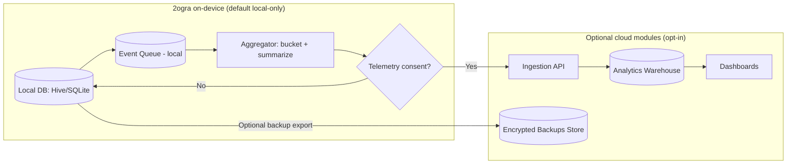

# 2ogra Data Collection Specification

## Executive summary

This specification defines a **privacy-minimal, offline-first** data model for 2ogra, with a strong default of **local-only storage** and strictly **opt-in** cloud usage. This approach aligns with key requirements in the Egyptian Personal Data Protection Law (Law 151/2020), including: explicit consent as a main basis for processing, purpose limitation, storage limitation, and deletion/anonymization after the purpose is satisfied; notably, the law treats **voice** as personal data and includes **financial data** (and biometric data) under “sensitive personal data.” citeturn7view0turn7view2turn8view3turn8view5turn7view3 Cloud features (sync/telemetry/fleet) can shift 2ogra into a higher compliance burden and potentially intersect with “service provider” obligations under Egypt’s cybercrime framework (e.g., log retention expectations). citeturn3view5turn3view7 The resulting design centers on **data minimization and security-by-default**, consistent with widely used GDPR-like principles (minimization, storage limitation, security of processing) and app-store disclosure expectations for collected/shared data. citeturn6search1turn4search2turn4search0turn4search5

## Regulatory baseline and privacy design principles

### Egyptian legal context that directly shapes data collection

Under entity["country","Egypt","north africa country"]’s Personal Data Protection Law No. 151/2020 (PDPL), key principles relevant to 2ogra’s design include: explicit consent as a general requirement, legitimate/specific/transparent purpose, data accuracy/security, and **not retaining personal data longer than necessary**. citeturn7view0turn7view3turn6search5 The PDPL also defines **personal data** broadly (explicitly including “voice”), and defines **sensitive personal data** to include **financial** and **biometric** data; processing sensitive personal data has stricter requirements (e.g., licensing and explicit written consent). citeturn8view5turn8view3turn7view4 It further sets out data subject rights (access, withdrawal of consent, correction/deletion, objection) and requires breach notification to the regulator within 72 hours and notifying affected individuals within 3 days (with immediate notification when national security concerns are implicated). citeturn8view2turn7view2

The PDPL establishes licensing concepts (license/permit/certification) and ties certain activities (collecting/storing/transferring/processing personal data and electronic marketing) to permissions issued by the Personal Data Protection Center, with defined durations. citeturn8view1turn8view2 In addition, for direct electronic marketing, the PDPL requires consent and maintaining records evidencing consent/non-objection for a defined period (e.g., three years from the last communication). citeturn3view0turn3view4

Separately, Egypt’s Anti-Cyber and Information Technology Crimes Law (Law 175/2018) sets obligations on “service providers,” including retaining and storing information system logs for 180 days (with specified categories of retained data). citeturn3view5turn3view7 This matters if 2ogra introduces cloud services (telemetry, fleet dashboards, backups) that could plausibly be viewed as providing ICT services—so the architecture intentionally makes cloud optional and minimizes identifiers and sensitive content to reduce exposure. citeturn3view5turn7view3turn8view3

### GDPR-like best-practice baseline for a mobile cash-handling app

Although PDPL is the primary local baseline, adopting GDPR-like principles helps operationalize “privacy by design”: data minimization and storage limitation (keep only what’s necessary for the purpose), and security of processing (appropriate technical/organizational measures, including encryption/pseudonymisation where appropriate). citeturn6search1turn6search4turn4search2turn4search6

From a distribution standpoint, both entity["company","Google","android and services company"] and entity["company","Apple","consumer electronics company"] require developers to disclose data collection and handling practices (Google Play “Data safety”; Apple App Privacy / “Privacy Nutrition Labels”), which influences SDK selection and telemetry scope for 2ogra. citeturn4search0turn4search5turn4search1turn4search37

### Non-negotiable design principles for 2ogra’s data collection

The following principles translate the above legal and platform context into implementable constraints:

A default **local-only** design minimizes compliance complexity and drastically reduces risk because the developer does not receive or retain user data off-device by default. citeturn7view0turn7view3turn4search0turn4search5 Any optional telemetry must be **opt-in**, purpose-specific, and avoid sensitive payloads; sensitive data should not be placed in logs (including analytics logs) under mobile security best practices. citeturn7view4turn5search3turn5search7 For cloud communication, encrypt in transit using modern TLS (e.g., TLS 1.3) and apply robust key management practices; for local secrets, store keys in platform keystores rather than plaintext. citeturn1search2turn1search27turn1search7turn1search3turn4search3

## Data inventory and field-level specification

### Sensitivity taxonomy used throughout this spec

This spec classifies fields using a practical sensitivity scale derived from PDPL definitions and common mobile privacy practice:

- **S0 (Low)**: app UX configuration, non-identifying settings.
- **S1 (Pseudonymous)**: random install/session identifiers; coarse device/app metadata (still potentially personal data if linkable). citeturn8view5turn4search6
- **S2 (Financial/behavioral)**: transaction amounts, pocket inventory, rounding behavior—especially if linkable to a person/device over time; treated as sensitive-by-design because PDPL includes “financial data” in sensitive personal data. citeturn8view3turn7view4
- **S3 (Biometric/voice)**: any raw voice/audio or persistent voice-derived identifiers; PDPL includes “voice” as personal data and includes “biometric” as sensitive. citeturn8view5turn8view3
- **S4 (Direct identifiers)**: phone number, email, national ID, precise location—should be avoided in MVP unless there is a compelling, consented purpose.

### Master table: data categories, storage location, and retention

The PDPL requires storage limitation and deletion (or retention in non-identifying form) when the purpose is satisfied; this table proposes retention windows accordingly and keeps most data local. citeturn7view3turn8view2turn3view2

| Data category | Examples | Sensitivity | Default storage | Optional cloud | Recommended retention |
|---|---|---:|---|---|---|
| App configuration | default fare, denomination set, UI mode | S0 | Device | No | Until user changes / app reset |
| Pocket inventory | counts by denomination; snapshots | S2 | Device | Backup only (encrypted blob) | Rolling 7–30 days snapshots (user configurable) |
| Transaction ledger | fare, paid amount, change plan, rounding | S2 | Device | **Not** raw; only aggregates | Rolling 30–90 days details; allow “Keep indefinitely” toggle |
| Presets and route profiles | preset name, fare value, shortcut buttons | S0–S1 | Device | Fleet sync (optional) | Until user deletes |
| Operational analytics (local) | daily totals, cannot-make-change rate | S1–S2 | Device | Aggregated only | 12–24 months aggregates (optional) |
| Telemetry (off-device) | event counts, latency buckets | S1 | Device queue → Cloud | Yes, opt-in | Raw events 30 days; aggregates 12 months |
| Voice mode artifacts | transcript, confidence | S3 (if stored) | Prefer ephemeral parse only | If cloud STT: avoid retention | 0 days (ephemeral); store only derived flags |
| Monetization state | premium entitlement flag | S0–S1 | Device + store | Minimal cloud | While subscription active (+ grace period) |

### Mandatory local-only data fields

The PDPL’s constraints (purpose limitation, storage limitation, deletion) and the fact that voice and financial data are sensitive/regulated inform the “local-only” default for the core ledger and pocket model. citeturn7view3turn8view3turn8view5turn3view2

#### AppConfig (single row / document)

| Field | Type | Example | Sensitivity | Why needed / product use | Retention | Notes |
|---|---:|---|---:|---|---|---|
| config_version | int | 1 | S0 | Manage migrations | Until upgrade | Increment on schema change |
| default_fare_minor | int | 1500 | S0 | Faster entry (MVP) | Until changed | Store in **minor units** (piastre) |
| currency_code | string | EGP | S0 | Display/format | Until changed | |
| denomination_set | json array[int] | [20000,10000,…,100] | S0 | Smart Change / Pocket Mode | Until changed | Can include 25/50 piastres per CBE denom list citeturn6search0 |
| pocket_mode_enabled | bool | true | S0 | Enables bounded change-making | Until changed | |
| smart_change_objective | enum | MIN_ITEMS | S0 | Change optimization | Until changed | MIN_ITEMS / PRESERVE_SMALL / BALANCED |
| rounding_enabled | bool | false | S0 | Later: policy tracking | Until changed | Default **off** (ethics) |
| rounding_max_minor | int | 100 | S0 | Later: tolerance | Until changed | Eg 1 EGP max = 100 piastres |
| locale | string | ar-EG | S0 | Localization | Until changed | Use OS locale |
| large_buttons | bool | true | S0 | Accessibility/one-handed | Until changed | |
| theme | enum | DARK | S0 | Night readability | Until changed | |

#### PocketInventory (current state)

| Field | Type | Example | Sensitivity | Why needed / product use | Retention | Notes |
|---|---:|---|---:|---|---|---|
| pocket_state_id | string (UUID) | … | S1 | Versioning / audit | Rolling | |
| updated_at | datetime | … | S1 | Reconciliation | Rolling | |
| denom_counts | map[int→int] | {20000:0,10000:1,…} | S2 | Feasible change plans | Rolling | Store as map in Hive; as rows in SQLite |
| pocket_floor_minor | int | 0 | S0 | Optional safety policy | Until changed | Minimum reserve not to break float |
| pocket_reset_reason | enum | START_DAY | S0 | Analytics + UX | Rolling 30 days | Optional |

#### PocketEvent (append-only log; optional but recommended for debugging)

Avoid sensitive logs off-device; this remains local and is user-deletable. citeturn5search3turn5search7

| Field | Type | Example | Sensitivity | Why needed / product use | Retention |
|---|---:|---|---:|---|---|
| pocket_event_id | UUID | … | S1 | Dedup/debug | 30–90 days |
| ts | datetime | … | S1 | Timeline | 30–90 days |
| action | enum | ADD / SUB / RESET | S0 | Pocket Mode | 30–90 days |
| denom_minor | int | 500 | S0 | Which bill/coin changed | 30–90 days |
| delta_count | int | +2 | S0 | How many | 30–90 days |
| reason | enum | CHANGE_GIVEN / MANUAL_ADJUST | S0 | Fraud/UX signals | 30–90 days |
| txn_id_ref | UUID? | … | S1 | Link to transaction | 30–90 days |

#### FarePreset (user-created shortcuts)

| Field | Type | Example | Sensitivity | Why needed / product use | Retention |
|---|---:|---|---:|---|---|
| preset_id | UUID | … | S1 | Reference | Until deleted |
| preset_label | string | “موقف رمسيس” | S1 | UX convenience | Until deleted |
| fare_minor | int | 1500 | S0 | Quick apply | Until deleted |
| riders_buttons | json array[int] | [1,2,3,4] | S0 | One-tap workflows | Until deleted |
| pay_buttons_minor | json array[int] | [2000,5000,10000] | S0 | “اتنين من 100” style taps | Until deleted |
| is_pinned | bool | true | S0 | Home screen ordering | Until deleted |

#### Transaction (core ledger)

Because PDPL treats “financial data” as sensitive personal data, the ledger is designed to be **local-only by default** and not mixed with identities. citeturn8view3turn7view4

| Field | Type | Example | Sensitivity | Why needed / product use mapping | Retention | Notes |
|---|---:|---|---:|---|---|---|
| txn_id | UUID | … | S1 | Primary key | 30–90 days (default) | |
| created_at | datetime | … | S1 | Daily analytics | 30–90 days | |
| fare_minor | int | 1500 | S2 | Total due calc | 30–90 days | |
| riders_count | int | 2 | S2 | Total due calc | 30–90 days | |
| amount_paid_minor | int | 10000 | S2 | Change due calc | 30–90 days | |
| total_due_minor | int | 3000 | S2 | Auditability | 30–90 days | Derived but stored for integrity |
| change_due_minor | int | 7000 | S2 | Core output | 30–90 days | May be 0 or negative |
| pocket_mode_used | bool | true | S0 | Feature KPI | 30–90 days | |
| change_plan_status | enum | FEASIBLE / INFEASIBLE / OVERRIDDEN | S0 | UX + fraud flags | 30–90 days | |
| change_plan_items | json array[{denom,count}] | [{5000,1},{2000,1}] | S2 | “What to give back” | 30–90 days | Store suggestion actually followed |
| change_plan_alt_count | int | 2 | S0 | Algorithm UX | 30–90 days | Count of alternatives computed |
| rounding_applied | bool | false | S0 | Ethics/fraud KPI | 30–90 days | Default false |
| rounding_delta_minor | int | 0 | S2 | Record rounding magnitude | 30–90 days | Positive means “kept” |
| manual_override | bool | false | S0 | UX friction indicator | 30–90 days | |
| override_reason | enum? | NO_CHANGE / CUSTOMER_LEFT | S0 | Insights | 30–90 days | Optional |
| compute_latency_ms | int | 120 | S1 | Must be <1s | 30–90 days | Performance KPI |
| algorithm_version | string | “sc-v1” | S0 | Debug regressions | 30–90 days | |

#### DailyAggregate (local rollups to reduce long-term sensitive retention)

Storing daily aggregates supports “earnings view” without keeping every transaction indefinitely; this supports storage limitation norms. citeturn7view3turn6search4

| Field | Type | Example | Sensitivity | Why needed | Retention |
|---|---:|---|---:|---|---|
| day | date | 2026-03-17 | S1 | Grouping | 12–24 months |
| txn_count | int | 148 | S1 | Activity | 12–24 months |
| sum_collected_minor | int | 284000 | S2 | Earnings view | 12–24 months |
| sum_change_given_minor | int | 190000 | S2 | Reconcile | 12–24 months |
| infeasible_count | int | 11 | S1 | “No change” pressure | 12–24 months |
| rounding_count | int | 4 | S1 | Ethics/monitoring | 12–24 months |
| rounding_sum_minor | int | 250 | S2 | Rounding exposure | 12–24 months |

### Optional cloud data fields (strictly opt-in)

If 2ogra sends data off-device, it becomes “collection” in app-store disclosure terms and increases PDPL compliance burden; PDPL requires explicit consent as a general condition and imposes breach notification obligations, among others. citeturn7view0turn7view2turn4search0turn4search5

This section defines “cloud” data as **optional modules** with separate consent toggles.

#### Cloud profile (pseudonymous; no direct identifiers)

| Field | Type | Example | Sensitivity | Why needed | Retention | Privacy rule |
|---|---:|---|---:|---|---|---|
| cloud_user_id | UUID | … | S1 | Backup/sync key | Until account deletion | Not email/phone based |
| install_id_hash | string | sha256(install_id+salt) | S1 | Device link | Rotate every 90 days | Prevent long-term tracking citeturn4search6 |
| created_at | datetime | … | S1 | Lifecycle | Until deletion | |
| last_seen_at | datetime | … | S1 | Sync | 12 months | |
| app_version | string | 1.2.0 | S0 | Debug | 12 months | |
| platform | enum | ANDROID | S0 | Debug | 12 months | |

#### Telemetry aggregates (recommended instead of raw transactions)

| Field | Type | Example | Sensitivity | Why needed | Retention | Privacy rule |
|---|---:|---|---:|---|---|---|
| day | date | 2026-03-17 | S1 | KPI trending | 12 months | No per-trip data |
| txn_count_bucketed | int | 100–199 | S1 | Usage | 12 months | Bucket counts |
| avg_latency_ms | int | 180 | S1 | Performance | 12 months | |
| infeasible_rate | float | 0.08 | S1 | Smart Change quality | 12 months | |
| rounding_rate | float | 0.02 | S1 | Ethical monitoring | 12 months | |
| voice_usage_rate | float | 0.14 | S1 | Voice Mode adoption | 12 months | |

#### Backup blobs (end-to-end encrypted recommended)

| Field | Type | Example | Sensitivity | Why needed | Retention | Privacy rule |
|---|---:|---|---:|---|---|---|
| backup_id | UUID | … | S1 | Restore | 90 days | Rolling backups |
| backup_created_at | datetime | … | S1 | Restore policy | 90 days | |
| ciphertext_blob | bytes | … | S2 | Contains ledger | 90 days | Encrypt client-side |
| ciphertext_version | string | “enc-v1” | S0 | Migration | 90 days | |
| key_wrapped | bytes | … | S1 | Key mgmt | 90 days | Use keystore-wrapped key citeturn1search7turn1search3turn4search3 |

#### Fleet sync (only for formal operators; highest risk module)

Because fleet sync may reintroduce identifiers (vehicle, depot, staff), it should be treated as a separate “enterprise” feature with explicit onboarding and DPO/records readiness (PDPL requires a DPO role within regulated entities and breach reporting timelines). citeturn7view2turn8view2

| Field | Type | Example | Sensitivity | Why needed | Retention | Privacy rule |
|---|---:|---|---:|---|---|---|
| org_id | UUID | … | S1 | Tenant isolation | Until termination | |
| vehicle_id | string | “H1-14seat-023” | S1 | Fleet analytics | 12 months | Avoid plate numbers |
| role | enum | COLLECTOR | S0 | Access control | Until changed | |
| shared_preset_set | json | … | S0–S1 | Standardize fares | Until deleted | |

### Data that should not be collected in MVP

Avoiding direct identifiers and tracking data reduces PDPL and app-store compliance complexity and minimizes harm if the device is lost. citeturn7view3turn4search0turn4search5

Do **not** collect by default: name, phone number, national ID, contact list, precise GPS, passenger photos, passenger audio recordings, advertising identifiers, or any stable cross-app tracking identifiers (unless monetization explicitly requires it and the user consents under platform policies). citeturn9search0turn9search3turn9search7turn4search1

## Event and analytics specification

### Consent-driven telemetry model

Telemetry is opt-in because (a) PDPL centers explicit consent for processing, and (b) app stores require disclosure of what data leaves the device, including via SDKs. citeturn7view0turn4search0turn4search5 A recommended implementation is “local event queue → aggregation → upload,” where raw events are short-lived and aggregates are retained longer. This also reduces risk under cybercrime log-retention exposure by keeping cloud records minimal and purpose-limited. citeturn3view5turn7view3

### Event envelope (common fields)

| Field | Type | Sensitivity | Why needed |
|---|---:|---:|---|
| schema_version | int | S0 | Parser compatibility |
| event_id | UUID | S1 | Deduplication |
| ts | datetime | S1 | Time series |
| session_id | UUID | S1 | Funnel analysis |
| install_id_hash | string | S1 | Cohort counting (rotating) |
| app_version | string | S0 | Regressions |
| platform | enum | S0 | Debug |
| locale | string | S0 | UX localization |
| event_name | string | S0 | Routing |
| params | object | S1–S2 | Event-specific |

### MVP event list and field payloads

Sensitive data must not be logged unnecessarily (mobile security guidance), and PDPL treats voice and financial data as sensitive/personal; thus MVP telemetry should avoid raw amounts and never include voice payloads, unless explicitly needed for debugging and strongly minimized/aggregated. citeturn8view5turn8view3turn5search3turn5search7

| Event | Trigger | MVP? | Key params (minimal) | Primary product use |
|---|---|---:|---|---|
| app_open | app foreground | ✅ | cold_start(bool) | DAU/retention |
| session_start | first interaction | ✅ | entry_screen | UX funnel |
| fare_set | fare changed | ✅ | source=manual/preset | Preset usefulness |
| txn_calculated | result shown | ✅ | riders_count, paid_denom_bucket, feasible(bool), latency_ms | Core KPI (<1s) |
| change_plan_selected | user taps suggested plan | ✅ | plan_items_count | Algorithm UX |
| change_plan_overridden | manual override | ✅ | reason_enum | Identify confusion |
| pocket_mode_toggled | settings | ✅ | enabled(bool) | Adoption |
| pocket_adjust | manual inventory edit | ✅ | denom_bucket, direction | Cash flow friction |
| infeasible_change | no plan exists | ✅ | deficit_bucket | Key pain point |
| rounding_applied | rounding used | ✅ (if enabled) | delta_bucket | Ethics monitoring |
| crash_reported | unhandled exceptions | ✅ | stack_hash | Stability |

### Later event list (Voice Mode, monetization, A/B testing)

Voice Mode increases sensitivity because “voice” is personal data in PDPL; if voice processing sends audio to cloud STT, that is off-device processing with elevated risk and consent needs. citeturn8view5turn7view0turn4search0

| Event | Trigger | Later? | Key params | Use |
|---|---|---:|---|---|
| voice_start | mic starts | ✅ | mode=ondevice/cloud | Consent enforcement |
| voice_result | parsed command | ✅ | success(bool), conf_bucket, latency_ms | STT KPI |
| voice_parse_error | cannot parse | ✅ | error_type | Improve grammar |
| ad_impression | ad shown | ✅ | format=banner/interstitial | Monetization |
| premium_purchase | IAP success | ✅ | sku | Revenue |
| experiment_assign | A/B bucket | ✅ | exp_id, variant | UX iteration |

### Sample telemetry payloads (JSON)

```json
{
  "schema_version": 1,
  "event_id": "6c73c3f0-2716-4d68-9f86-8c5e6c22db1d",
  "ts": "2026-03-17T08:41:12.491+02:00",
  "session_id": "a7d2d1a7-0a86-41b8-9941-3fd3c4a8b0ed",
  "install_id_hash": "sha256:9b1f... (rotates every 90d)",
  "app_version": "0.1.0",
  "platform": "ANDROID",
  "locale": "ar-EG",
  "event_name": "txn_calculated",
  "params": {
    "riders_count": 2,
    "paid_denom_bucket": "100",
    "feasible": true,
    "plan_items_count": 2,
    "latency_ms": 140,
    "pocket_mode_used": true
  }
}
```

```json
{
  "schema_version": 1,
  "event_id": "4517e3ac-2f95-4d8f-a0fb-5f2a7b2d2d23",
  "ts": "2026-03-17T09:02:44.102+02:00",
  "session_id": "a7d2d1a7-0a86-41b8-9941-3fd3c4a8b0ed",
  "install_id_hash": "sha256:9b1f...",
  "app_version": "0.1.0",
  "platform": "ANDROID",
  "locale": "ar-EG",
  "event_name": "infeasible_change",
  "params": {
    "change_due_bucket": "50-99",
    "constraint": "insufficient_inventory",
    "suggested_action": "request_smaller_bill"
  }
}
```

```json
{
  "schema_version": 1,
  "event_id": "f0f7f7d4-cc5a-4fd4-8bb4-47cb8b7fa9d1",
  "ts": "2026-03-17T09:05:09.611+02:00",
  "session_id": "a7d2d1a7-0a86-41b8-9941-3fd3c4a8b0ed",
  "install_id_hash": "sha256:9b1f...",
  "app_version": "0.1.0",
  "platform": "ANDROID",
  "locale": "ar-EG",
  "event_name": "rounding_applied",
  "params": {
    "rounding_delta_bucket": "1",
    "policy_mode": "only_if_infeasible"
  }
}
```

These examples intentionally avoid sending raw fare/amount values off-device to reduce sensitive “financial data” exposure under PDPL. citeturn8view3turn7view4

### Data flow diagram for telemetry and optional sync



The above emphasizes “off-device only with consent,” consistent with explicit-consent-centered processing and app-store disclosure expectations. citeturn7view0turn4search0turn4search5

## Storage schemas, encryption rules, and analytics queries

### Encryption-at-rest / in-transit guidance

For any cloud communication, use modern TLS to reduce eavesdropping/tampering risk (TLS 1.3 is specified as a secure transport protocol standard), and follow current IETF guidance that implementations should support and prefer TLS 1.3. citeturn1search2turn1search27 For on-device protection, store secrets and encryption keys using platform keystores (Android Keystore / iOS Keychain) and avoid writing sensitive data into logs. citeturn1search7turn1search3turn5search3turn5search7 Key-management practices should follow established guidance such as entity["organization","NIST","us standards agency"] SP 800‑57 recommendations. citeturn4search3turn4search7

### Hive schema example (boxes + adapters)

```dart
// Hive TypeIds are illustrative.
@HiveType(typeId: 1)
class AppConfig extends HiveObject {
  @HiveField(0) int configVersion;
  @HiveField(1) int defaultFareMinor;
  @HiveField(2) String currencyCode;         // "EGP"
  @HiveField(3) List<int> denominationSet;   // minor units
  @HiveField(4) bool pocketModeEnabled;
  @HiveField(5) String smartChangeObjective; // e.g., "MIN_ITEMS"
  @HiveField(6) bool roundingEnabled;
  @HiveField(7) int roundingMaxMinor;
  @HiveField(8) String locale;               // "ar-EG"
  @HiveField(9) bool largeButtons;
  @HiveField(10) String theme;               // "DARK"
}

@HiveType(typeId: 2)
class PocketInventory extends HiveObject {
  @HiveField(0) String pocketStateId;          // UUID
  @HiveField(1) DateTime updatedAt;
  @HiveField(2) Map<int, int> denomCounts;     // denom_minor -> count
  @HiveField(3) int pocketFloorMinor;
}

@HiveType(typeId: 3)
class TransactionRecord extends HiveObject {
  @HiveField(0) String txnId;
  @HiveField(1) DateTime createdAt;
  @HiveField(2) int fareMinor;
  @HiveField(3) int ridersCount;
  @HiveField(4) int amountPaidMinor;
  @HiveField(5) int totalDueMinor;
  @HiveField(6) int changeDueMinor;
  @HiveField(7) bool pocketModeUsed;
  @HiveField(8) String changePlanStatus;
  @HiveField(9) List<ChangeItem> changePlanItems;
  @HiveField(10) int changePlanAltCount;
  @HiveField(11) bool roundingApplied;
  @HiveField(12) int roundingDeltaMinor;
  @HiveField(13) bool manualOverride;
  @HiveField(14) String? overrideReason;
  @HiveField(15) int computeLatencyMs;
  @HiveField(16) String algorithmVersion;
}

@HiveType(typeId: 4)
class ChangeItem {
  @HiveField(0) int denomMinor;
  @HiveField(1) int count;
}
```

### SQLite schema example (DDL)

```sql
CREATE TABLE app_config (
  config_version INTEGER NOT NULL,
  default_fare_minor INTEGER NOT NULL,
  currency_code TEXT NOT NULL,
  denomination_set_json TEXT NOT NULL,
  pocket_mode_enabled INTEGER NOT NULL,
  smart_change_objective TEXT NOT NULL,
  rounding_enabled INTEGER NOT NULL,
  rounding_max_minor INTEGER NOT NULL,
  locale TEXT NOT NULL,
  large_buttons INTEGER NOT NULL,
  theme TEXT NOT NULL
);

CREATE TABLE pocket_inventory (
  pocket_state_id TEXT PRIMARY KEY,
  updated_at TEXT NOT NULL,
  pocket_floor_minor INTEGER NOT NULL
);

CREATE TABLE pocket_inventory_items (
  pocket_state_id TEXT NOT NULL,
  denom_minor INTEGER NOT NULL,
  count INTEGER NOT NULL,
  PRIMARY KEY (pocket_state_id, denom_minor),
  FOREIGN KEY (pocket_state_id) REFERENCES pocket_inventory(pocket_state_id)
);

CREATE TABLE transactions (
  txn_id TEXT PRIMARY KEY,
  created_at TEXT NOT NULL,
  fare_minor INTEGER NOT NULL,
  riders_count INTEGER NOT NULL,
  amount_paid_minor INTEGER NOT NULL,
  total_due_minor INTEGER NOT NULL,
  change_due_minor INTEGER NOT NULL,
  pocket_mode_used INTEGER NOT NULL,
  change_plan_status TEXT NOT NULL,
  change_plan_alt_count INTEGER NOT NULL,
  rounding_applied INTEGER NOT NULL,
  rounding_delta_minor INTEGER NOT NULL,
  manual_override INTEGER NOT NULL,
  override_reason TEXT,
  compute_latency_ms INTEGER NOT NULL,
  algorithm_version TEXT NOT NULL
);

CREATE TABLE transaction_change_items (
  txn_id TEXT NOT NULL,
  denom_minor INTEGER NOT NULL,
  count INTEGER NOT NULL,
  PRIMARY KEY (txn_id, denom_minor),
  FOREIGN KEY (txn_id) REFERENCES transactions(txn_id)
);

CREATE TABLE daily_aggregates (
  day TEXT PRIMARY KEY,
  txn_count INTEGER NOT NULL,
  sum_collected_minor INTEGER NOT NULL,
  sum_change_given_minor INTEGER NOT NULL,
  infeasible_count INTEGER NOT NULL,
  rounding_count INTEGER NOT NULL,
  rounding_sum_minor INTEGER NOT NULL
);

CREATE TABLE events_local_queue (
  event_id TEXT PRIMARY KEY,
  ts TEXT NOT NULL,
  session_id TEXT NOT NULL,
  event_name TEXT NOT NULL,
  params_json TEXT NOT NULL,
  upload_state TEXT NOT NULL  -- "PENDING", "SENT", "FAILED"
);
```

### Suggested KPIs and SQL queries

These KPIs focus on performance (<1s), algorithm feasibility, and ethical red flags (rounding spikes). The performance target aligns with the PDPL’s emphasis on security/organizational controls and the general expectation that the app remains usable without adding risk via prolonged interaction. citeturn7view3turn4search2

**Average compute latency (ms)**
```sql
SELECT
  date(created_at) AS day,
  AVG(compute_latency_ms) AS avg_latency_ms
FROM transactions
GROUP BY day
ORDER BY day DESC;
```

**Feasibility rate (how often the app can make change in Pocket Mode)**
```sql
SELECT
  date(created_at) AS day,
  AVG(CASE WHEN change_plan_status = 'FEASIBLE' THEN 1.0 ELSE 0.0 END) AS feasible_rate
FROM transactions
WHERE pocket_mode_used = 1
GROUP BY day;
```

**Rounding usage rate and sum (ethical exposure)**
```sql
SELECT
  date(created_at) AS day,
  SUM(CASE WHEN rounding_applied = 1 THEN 1 ELSE 0 END) AS rounding_count,
  SUM(rounding_delta_minor) AS rounding_sum_minor,
  CAST(SUM(CASE WHEN rounding_applied = 1 THEN 1 ELSE 0 END) AS REAL) / COUNT(*) AS rounding_rate
FROM transactions
GROUP BY day;
```

**Override rate (UX friction)**
```sql
SELECT
  date(created_at) AS day,
  AVG(CASE WHEN manual_override = 1 THEN 1.0 ELSE 0.0 END) AS override_rate
FROM transactions
GROUP BY day;
```

**“Cannot make change” hotspot (which paid denominations create the most infeasible outcomes)**  
(Requires storing a paid denomination bucket locally; if not stored in `transactions`, compute from `amount_paid_minor`.)
```sql
SELECT
  CASE
    WHEN amount_paid_minor = 20000 THEN '200'
    WHEN amount_paid_minor = 10000 THEN '100'
    WHEN amount_paid_minor = 5000  THEN '50'
    WHEN amount_paid_minor = 2000  THEN '20'
    WHEN amount_paid_minor = 1000  THEN '10'
    WHEN amount_paid_minor = 500   THEN '5'
    WHEN amount_paid_minor = 100   THEN '1'
    ELSE 'other'
  END AS paid_bucket,
  AVG(CASE WHEN change_plan_status = 'INFEASIBLE' THEN 1.0 ELSE 0.0 END) AS infeasible_rate
FROM transactions
GROUP BY paid_bucket
ORDER BY infeasible_rate DESC;
```

## Field research data collection plan, quality checks, and ethical/fraud flags

### Field research instrumentation plan

This plan distinguishes between (a) production analytics (opt-in, minimized) and (b) a **research build** used during supervised in-vehicle testing, where participants consent to additional measurement. This distinction supports purpose limitation and explicit consent requirements. citeturn7view0turn7view3turn4search0

#### Recommended qualitative sample sizing and iteration cadence

A pragmatic approach is iterative qualitative testing with small groups; usability research literature commonly recommends ~5 participants per iteration to find most usability issues, with repeated small tests. citeturn5search0turn5search4 For microbus conditions variability (routes, noise, different change floats), multiple iterations across contexts are recommended rather than a single large study. citeturn5search4turn5search32

#### In-vehicle metrics to capture (research build)

| Metric | Field name | Type | Why | Privacy approach |
|---|---|---:|---|---|
| Time-to-result | t_result_ms | int | Core success metric | No identifiers |
| Tap count | tap_count | int | One-handed UX load | No identifiers |
| Error type | error_enum | enum | Classify failures | No identifiers |
| Dispute occurrence | dispute_flag | bool | Real-world impact | No identifiers |
| Ground-truth delta | delta_minor | int | Wrong-change measurement | No identity |
| Noise level | noise_dbA_est | float | Voice-mode feasibility | **No audio stored** |

Noise measurement: smartphones can capture sound levels across a wide range, but accuracy depends on calibration; research indicates smartphone microphones (MEMS) can capture signals up to high SPL ranges and many studies evaluate smartphone sound measurement apps, but accuracy varies and may require external microphones for precision. citeturn5search1turn5search17turn5search37 For ethics and PDPL alignment, do not store raw audio; store only a computed dB(A)-like estimate per session, and only in the controlled research build with explicit consent. citeturn8view5turn7view0

### Interview and survey questions (data collection for discovery)

These questions are framed to avoid collecting unnecessary personal data—consistent with minimization/storage limitation practices. citeturn6search4turn6search11turn7view3

Collector/driver:
- “How often do you run out of 5/10/20 change during a typical shift? What do you do then?”
- “Which paid notes cause the most problems (50/100/200)? How do you handle ‘bاقي’ disputes?”
- “Do you prefer preserving small change or minimizing how many bills you hand back?”
- “Would you accept a consistent rounding policy only when exact change is impossible?”

Passenger:
- “How often do change disputes happen per week on your route?”
- “Would a screen showing ‘total due / paid / change / breakdown’ reduce arguments?”

### Ground-truth labeling protocol (what “correct change” is)

Ground truth should be recorded as:
1) fare × riders = total due  
2) paid − total due = correct change due  
3) the feasible “correct” change breakdown is the set of bills/coins that sums to the correct change under the PocketInventory constraints at the time of the transaction.  
This labeling approach evaluates both arithmetic correctness and feasibility under cash constraints while keeping personal identifiers out of the dataset. citeturn7view3turn8view3

### Data quality checks (on-device + cloud)

Because sensitive data should not be logged broadly, quality checks should run locally and only emit coarse diagnostics if telemetry is enabled. citeturn5search3turn5search7turn4search0

Recommended checks:
- **Non-negativity**: denom counts must never drop below 0 (inventory integrity).
- **Conservation**: if Pocket Mode auto-updates, then: `new_inventory = old + paid_denom - change_plan`.  
- **Arithmetic consistency**: `total_due_minor == fare_minor * riders_count`; `change_due_minor == amount_paid_minor - total_due_minor`.
- **Latency thresholds**: flag compute_latency_ms > 1000 (performance regression).

### Anomaly detection and ethical/fraud flags

Because rounding can be abused, monitoring should treat rounding as an **ethical risk indicator**, not “optimization.” PDPL places strict limits on processing and emphasizes deletion/limitation; the safest approach is to keep these checks local and only send aggregates with consent. citeturn7view3turn7view0turn8view3

Rules (compute daily on device):
- **Rounding spike**: rounding_rate increases > 3× 7-day baseline.
- **Chronic infeasible change**: infeasible_rate > threshold (e.g., 15%) for 3 consecutive days → suggests UI confusion or inadequate float.
- **High override rate**: manual_override_rate > threshold → indicates Smart Change suggestions not matching real practice.
- **Repeated unresolved infeasible**: N infeasible events without a “resolved” follow-up within session → potential workflow gap.
- **Unbalanced ledger**: sum_collected − sum_change_given − expected_net deviates beyond tolerance → indicates logging errors or manipulation.

If cloud telemetry is enabled, upload only **aggregated flags** (e.g., a boolean “rounding_spike_today”) rather than raw transaction logs to reduce sensitive data exposure. citeturn8view3turn4search6

### Trade-off table: local-only vs cloud sync

This trade-off is driven by PDPL explicit consent, retention limitation, sensitive data definitions, and cybercrime service-provider log-retention exposure. citeturn7view0turn7view3turn8view3turn3view5

| Approach | Benefits | Costs/risks | Recommendation |
|---|---|---|---|
| Local-only (default) | Minimal compliance surface; no off-device leakage; works offline | Limited product analytics; no backup | MVP default |
| Opt-in aggregates only | Enough to improve UX/algorithm; low sensitivity | Requires consent + disclosures | Recommended “Phase 1 cloud” |
| Encrypted backups | User value (device loss) | Must implement strong key mgmt | Phase 2, enterprise optional |
| Fleet sync / dashboards | Monetizable B2B | Highest compliance/retention burden; potential “service provider” obligations | Only with formal operators and strong governance |

## Prioritized minimum set of fields and events

### MVP minimum (ship-fast, privacy-minimal)

- Local tables/docs: AppConfig, PocketInventory, FarePreset, TransactionRecord, DailyAggregate (optional), ConsentState.
- No cloud by default.
- Events (local only): txn_calculated, infeasible_change, pocket_adjust, rounding_applied (only if rounding enabled), crash_reported (opt-in).

This aligns with minimization and storage limitation principles in PDPL/GDPR-like guidance and reduces app-store disclosure complexity. citeturn7view3turn6search1turn4search0turn4search5

### Later (validated expansions)

- Voice Mode metrics: store only success/confidence/latency, not audio; treat voice as personal data and minimize retention. citeturn8view5turn8view3  
- Cloud aggregates and backups: TLS 1.3 in transit; encryption keys protected by platform keystore + disciplined key management. citeturn1search2turn1search7turn4search3  
- Monetization: adding ads introduces SDK-driven data collection and triggers expanded app-store disclosures; iOS tracking requires ATT permission for device advertising identifier usage. citeturn4search0turn9search0turn9search3turn9search7