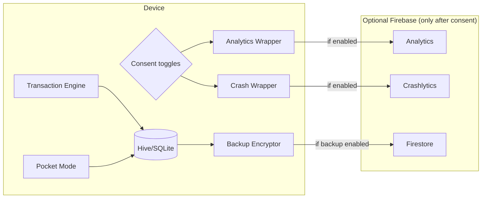

# Development Guidelines for Building 2ogra in Flutter with Riverpod and Optional Firebase Cloud

2ogra should be built as an **offline-first, one-handed, high-throughput** cash tool where the “local transaction engine + Pocket Mode inventory” is always available, and **Firebase features remain strictly optional** behind explicit consent. Riverpod’s modern Notifier-based providers are well-suited for this: they structure state that changes due to user actions, while supporting clean dependency injection and test overrides via `ProviderScope`. citeturn0search9turn5search18turn5search0 Optional cloud must be treated as a privacy and compliance “upgrade”: only enable Analytics/Crashlytics/Firestore after consent, and keep payloads pseudonymous and minimal to satisfy data minimization expectations and app-store disclosure obligations. citeturn6search4turn6search3turn6search10 The key engineering target is deterministic speed: **<1s calculation end-to-end**, and UI smoothness with frames staying within ~16ms on 60Hz devices to avoid jank. citeturn8search0turn8search7

## Architecture and project structure

### Architectural stance

Use a pragmatic “clean-ish” architecture with strict boundaries:

- **Presentation** (widgets, screens) depends on
- **Application** (Riverpod notifiers/controllers) depends on
- **Domain** (pure logic: Smart Change algorithm, models) depends on
- **Data** (local persistence + optional Firebase repositories)

This keeps the Smart Change algorithm testable (pure Dart) and isolates Firebase concerns as optional adapters. Riverpod is particularly strong for dependency injection and swapping implementations via provider overrides. citeturn5search0turn5search21

### Recommended folder layout

A feature-first layout keeps highly cohesive code together while preserving shared “core” modules.

```
lib/
  main.dart
  src/
    bootstrap/
      app.dart
      firebase_init.dart
      env.dart
      consent_gate.dart
    core/
      analytics/
        analytics_service.dart
        analytics_events.dart
      crash/
        crash_reporter.dart
      crypto/
        backup_crypto.dart
        key_manager.dart
      ids/
        install_id.dart
      platform/
        device_info.dart
      ui/
        theme.dart
        spacing.dart
        widgets/
          big_button.dart
          denom_grid.dart
          bottom_sheet_handle.dart
    features/
      collect/
        domain/
          change_algorithm.dart
          transaction.dart
          change_plan.dart
        data/
          local_transaction_repo.dart
          local_models.dart
        application/
          collect_controller.dart
          collect_state.dart
        presentation/
          collect_screen.dart
          widgets/
            fare_header.dart
            riders_stepper.dart
            pay_denom_pad.dart
            result_panel.dart
      pocket/
        domain/
          pocket_inventory.dart
        data/
          local_pocket_repo.dart
        application/
          pocket_controller.dart
        presentation/
          pocket_screen.dart
      presets/
        domain/
          preset.dart
        data/
          local_preset_repo.dart
          firestore_preset_repo.dart   // optional
        application/
          presets_controller.dart
        presentation/
          presets_screen.dart
      voice/
        domain/
          voice_command.dart
          voice_parse.dart
        data/
          stt_service.dart            // optional provider
        application/
          voice_controller.dart
        presentation/
          voice_overlay.dart
      settings/
        domain/
          app_settings.dart
          consent_state.dart
        data/
          local_settings_repo.dart
          firestore_backup_repo.dart  // optional
        application/
          settings_controller.dart
        presentation/
          settings_screen.dart
      reports/
        domain/
          rollups.dart
        data/
          local_rollup_repo.dart
        application/
          reports_controller.dart
        presentation/
          reports_screen.dart
test/
integration_test/
```

### Package choices

- Local storage: Hive (fast KV + small object graphs) or SQLite (stronger aggregation queries). Prefer Hive for MVP; switch to SQLite if you need heavy reporting or integrity constraints.
- Secure key storage: `flutter_secure_storage` for small secrets (backup encryption keys), because it leverages platform secure storage (iOS Keychain, Android encrypted preferences/keystore-backed key handling). citeturn4search2turn4search1
- Optional cloud: Firestore for backups/presets/fleet sync; ensure offline persistence behavior is understood (mobile offline persistence is enabled by default for Android/Apple). citeturn1search1turn9search3

## Riverpod provider architecture mapped to 2ogra features

### Core Riverpod concepts to apply

- Put a single `ProviderScope` at the app root. citeturn5search18  
- Use Notifier-based providers for interactive state (“recommended solution for managing state which may change in reaction to a user interaction”). citeturn0search9  
- Use `autoDispose` for screen-scoped controllers when state shouldn’t persist after leaving the screen (e.g., temporary transaction input buffers). citeturn5search1  
- Use provider overrides to swap “local-only” vs “Firestore-enabled” repositories and to inject fakes in tests. citeturn5search0  
- Consider `ProviderObserver` for debug logging and (only if consented) analytics about provider lifecycle. citeturn5search2  

### Provider list table

The table below is a concrete baseline that scales from MVP (local-only) to v1 (optional cloud).

| Provider name (example) | Type | autoDispose | Depends on | Feature | Responsibility |
|---|---|---:|---|---|---|
| `envProvider` | `Provider<Env>` | No | — | Bootstrap | Flavor + feature flags (local-only, analytics enabled, cloud enabled) |
| `installIdProvider` | `AsyncNotifierProvider<InstallIdCtrl, String>` | No | secure storage | IDs | Create/store stable local install ID; never upload raw |
| `consentProvider` | `NotifierProvider<ConsentCtrl, ConsentState>` | No | settings repo | Consent | Telemetry toggles; gates Firebase init |
| `settingsProvider` | `NotifierProvider<SettingsCtrl, AppSettings>` | No | local settings repo | Settings | Fare defaults, rounding policy, UI prefs |
| `pocketProvider` | `NotifierProvider<PocketCtrl, PocketState>` | No | pocket repo | Pocket Mode | Inventory counts; update on payments/change |
| `presetsProvider` | `AsyncNotifierProvider<PresetsCtrl, PresetsState>` | Yes | preset repo | Presets | Load/save presets; optional sync |
| `collectProvider` | `NotifierProvider<CollectCtrl, CollectState>` | Yes | settings + pocket + engine | Collect | Transaction input buffer + results |
| `txEngineProvider` | `Provider<TransactionEngine>` | No | — | Smart Change | Pure algorithm instance |
| `analyticsProvider` | `Provider<AnalyticsService>` | No | consent | Telemetry | Wrapper around Firebase Analytics; no-op if no consent |
| `crashReporterProvider` | `Provider<CrashReporter>` | No | consent | Crash | Wrapper around Crashlytics; no-op if no consent |
| `firestoreProvider` | `Provider<FirebaseFirestore?>` | No | consent + env | Cloud | Null unless cloud consent granted |
| `backupRepoProvider` | `Provider<BackupRepo>` | No | firestore? + crypto | Backups | Local-only default; Firestore optional |
| `voiceProvider` | `AsyncNotifierProvider<VoiceCtrl, VoiceState>` | Yes | STT service | Voice | Optional; can be disabled entirely without consent |

Riverpod sub-scoping should be used sparingly; if used, do it via overrides and explicit provider dependencies. citeturn5search3

### Mermaid diagram: high-level provider and layer relationships

```mermaid
flowchart TB
  UI[Flutter UI Screens] --> C1[Riverpod Controllers (Notifiers)]
  C1 --> D1[Domain: Transaction Engine]
  C1 --> R1[Repos: Local Storage]
  C1 --> R2[Repos: Optional Firebase]
  R1 --> LDB[(Hive/SQLite)]
  R2 --> FS[(Firestore)]
  C1 --> A1[Analytics Service Wrapper]
  C1 --> X1[Crash Reporter Wrapper]
  A1 --> FA[Firebase Analytics]
  X1 --> FC[Crashlytics]
```

## UI screens and one-handed interaction specification

2ogra’s UI should assume **standing use**, **noise**, and **one-hand constraints**, so all high-frequency actions must be in the lower half of the screen and must avoid typing.

### Touch target and pixel-level sizing

Minimum tap target guidance: Material and Flutter accessibility guidance both recommend **~48×48 dp** minimum tap target on Android; this is also aligned with Android accessibility guidance. citeturn0search6turn0search14turn0search30

Practical pixel notes (to design “pixel-level” layouts):
- In Flutter, sizing uses logical pixels (dp). Physical pixels ≈ dp × devicePixelRatio.
- Examples:
  - On a 3.0 DPR device: 48 dp ≈ 144 px.
  - On a 2.75 DPR device: 48 dp ≈ 132 px.

### Screen list and interaction notes

#### Collect screen (primary “transaction console”)

Layout objective: “single glance + three taps” to complete most transactions.

- **Top strip (height ~72 dp)**: Fare display + quick adjust (+1, +2, -1) and optional preset selector.
  - Avoid text fields; use bottom sheet modal numeric input only for rare fare edits.
- **Riders selector**: large segmented control or stepper with big +/-.
  - Preferred: `1–4` quick chips + “More…” opens bottom sheet with 1–14 grid.
  - Microbus capacities commonly 11–14 seats; your UI should support up to 14 riders for “batch pay” scenarios. citeturn1search1turn0search6
- **Payment pad** (bottom half, fixed): 2–3 row grid of denomination buttons (1, 5, 10, 20, 50, 100, 200).
  - Each button: min 56 dp height; label large (20–24 sp); haptic feedback optional.
- **Result panel** (above pad): shows Total Due + Paid + Change Due + Suggested breakdown.
  - Provide a single large “Confirm” and a secondary “Alternate breakdown” action.
- **Edge case states**:
  - If `change_due < 0`: show “Still Owed” prominently and disable change plan.
  - If infeasible change with Pocket Mode: show “Cannot make change” plus “Request smaller bill” and “IOU/Partial” options (no hidden flows).

#### Pocket screen (inventory management)

- Default view: denomination list with + / - for each, large controls.
- One action per row: denom label on left, `[-] [count] [+]` on right.
- Add “Start of shift” quick preset: “Mostly 5/10/20” (configurable).
- Show “Last updated” time.

#### Presets screen (routes/fare presets + “one-tap phrases”)

- List of presets: each row has fare, common rider counts, common pay buttons.
- Add “Pin to Collect screen.”

#### Reports screen (daily rollups)

- Minimal: today’s totals and key counters (infeasible count, rounding count).
- Avoid complex charts in MVP; keep text-based.

#### Settings and Consent screen

- Separate “Privacy & Data” section:
  - Analytics toggle (off by default).
  - Crash reports toggle (off by default if you adopt strict opt-in).
  - Cloud backups toggle (off; indicates “encrypted backup”).
- Show short descriptions of what’s collected and why.

### Navigation pattern

Use bottom navigation with 3–4 destinations max; Material guidance recommends bottom navigation for 3–5 top-level destinations. citeturn8search8turn8search34  
Recommended tabs:
- Collect
- Pocket
- Presets
- Settings (or Reports)

One-handed rationale: bottom navigation keeps primary actions within thumb reach (and iOS reachability exists primarily because top-of-screen is hard to access one-handed). citeturn8search2turn8search35

## Firebase optional cloud features: Firestore, Analytics, Crashlytics

### Consent gating: what initializes when

Implement a “consent gate” at app startup to decide:

- Local-only: initialize local DB and run app.
- If user opted into cloud features: initialize Firebase core, sign-in (anonymous), enable Firestore usage, then enable Analytics/Crashlytics collection.

Firebase Analytics and Crashlytics both support disabling/controlling collection—use that to implement opt-in behaviors. citeturn0search1turn7search0turn2search10

### Firestore data model

Firestore should not store raw transaction ledgers in v1. Use it for:
- **Encrypted backups** (ciphertext blobs)
- **Preset sync** (optional)
- **Fleet mode** (later; higher compliance and security needs)

Key fact: Firestore has a **~1 MiB document size limit** (and specific limits per field value). This directly affects encrypted backup design; you must chunk backups or use an alternative storage system. citeturn1search2turn1search10

#### Collections and documents table

| Path | Document ID | Fields (minimal) | Index needs | Purpose |
|---|---|---|---|---|
| `users/{uid}` | `uid` | `createdAt`, `appVersion`, `installIdHashRotating` | single-field | User root (pseudonymous) |
| `users/{uid}/backups/{backupId}` | UUID | `createdAt`, `schemaVersion`, `ciphertextMeta`, `chunkCount`, `ttlExpiresAt` | `createdAt desc` (optional) | Backup manifest |
| `users/{uid}/backups/{backupId}/chunks/{chunkId}` | `0000..NNNN` | `ciphertextChunk`, `seq`, `len` | `seq asc` | Backup chunks |
| `users/{uid}/presets/{presetId}` | UUID | `label`, `fareMinor`, `buttons`, `updatedAt` | `updatedAt desc` | Sync presets |
| `users/{uid}/telemetry_daily/{yyyyMMdd}` | date string | aggregated counters only | none/auto | Optional minimal cloud telemetry |

For retention, Firestore TTL policies can automatically delete documents after an expiration timestamp field; this is useful for backups and telemetry. citeturn9search2turn9search6

#### Indexing approach

Firestore requires an index for every query; basic indexes are automatic, and additional composite indexes must be created when you run compound queries (Firestore provides an error message with a link to create missing indexes). citeturn9search24turn9search8  
Keep your query patterns very simple (mostly document reads by path) to reduce index complexity and cost.

### Firestore security rules and access control

Firestore’s own guidance states that to build user-based and role-based access systems, you need Firebase Authentication with Firestore Security Rules. citeturn1search4turn2search7

For 2ogra, “pseudonymous install IDs” are best implemented as:
- **Firebase anonymous auth UID** as the principal identity for Firestore access.
- A rotating `installIdHash` stored as metadata only, not used as the access control primitive.

#### Example security rules (tight and validation-oriented)

```js
rules_version = '2';
service cloud.firestore {
  match /databases/{database}/documents {

    function isSignedIn() {
      return request.auth != null;
    }

    function isOwner(uid) {
      return isSignedIn() && request.auth.uid == uid;
    }

    match /users/{uid} {
      allow read, create, update: if isOwner(uid);
      allow delete: if false; // consider delete via in-app "delete cloud data" flow

      match /backups/{backupId} {
        allow read, create: if isOwner(uid)
          && request.resource.data.schemaVersion is int
          && request.resource.data.createdAt is timestamp
          && request.resource.data.chunkCount is int
          && request.resource.data.chunkCount >= 1
          && request.resource.data.chunkCount <= 64; // protect against abuse
        allow update, delete: if isOwner(uid);

        match /chunks/{chunkId} {
          allow read, create: if isOwner(uid)
            && request.resource.data.seq is int
            && request.resource.data.len is int
            && request.resource.data.len <= 950000; // safety margin under 1MiB
          allow update, delete: if isOwner(uid);
        }
      }

      match /presets/{presetId} {
        allow read, write: if isOwner(uid);
      }

      match /telemetry_daily/{dayId} {
        allow read, write: if isOwner(uid);
      }
    }
  }
}
```

Rules should validate incoming data (`request.resource.data`) to prevent abuse and corrupted schema writes. citeturn2search3turn2search7  
Be aware that security rules interact with queries in specific ways; enforce path-based access where possible. citeturn9search1turn2search23

### Hardening Firestore endpoints: App Check

Firebase App Check is designed to help protect backend resources by preventing unauthorized clients from accessing Firebase resources; use it once cloud features exist and you want to reduce scripted abuse. citeturn1search3turn1search36

### Firebase Analytics event mapping and constraints

Firebase Analytics (GA4 for Firebase) enforces event/parameter constraints: event names have length restrictions; in Flutter event parameters have naming and length limits (parameter name up to 40 chars; string values up to 100 chars; and limits on number of parameters per event). citeturn2search5turn2search4  
Design events as **bucketed and non-sensitive**, consistent with your telemetry spec.

#### Analytics event mapping table (from the telemetry spec)

| In-app event | Firebase event name | Core params (bucketed) | Notes |
|---|---|---|---|
| app_open | `app_open` (auto) + custom `app_open_2ogra` | `cold_start` | Prefer custom name if you need separation |
| session_start | `session_start_2ogra` | `entry_screen` | Keep ≤ 40 chars |
| fare_set | `fare_set` | `source` | Do not log raw fare; log `source` only |
| txn_calculated | `txn_calculated` | `riders_count`, `paid_bucket`, `feasible`, `latency_ms_bucket`, `pocket_mode_used` | Keep params ≤ 25; bucket latency |
| infeasible_change | `infeasible_change` | `change_due_bucket`, `constraint` | Avoid raw amounts |
| pocket_adjust | `pocket_adjust` | `denom_bucket`, `direction`, `reason` | No counts off-device |
| rounding_applied | `rounding_applied` | `delta_bucket`, `policy_mode` | Treat as ethical monitoring |
| voice_start | `voice_start` | `mode` | Only if voice consent |
| voice_result | `voice_result` | `success`, `conf_bucket`, `latency_bucket` | Never send transcript by default |
| crash_reported | Crashlytics, not Analytics | `error_domain` | Use Crashlytics keys |

### Crashlytics integration and error handling strategy

Crashlytics Flutter setup: typical integration routes Flutter framework errors to Crashlytics by assigning `FlutterError.onError`. citeturn0search5turn0search36  
You should also catch uncaught async errors in a top-level zone (or platform dispatcher handling), then report them as non-fatal unless truly fatal. citeturn0search2turn2search10

Crashlytics supports opting into collection via `setCrashlyticsCollectionEnabled` and supports custom keys and user identifiers (which should remain pseudonymous). citeturn7search0turn7search3

A critical policy decision: if you adopt strict opt-in crash reporting, disable automatic reporting natively and only enable after consent (Crashlytics docs provide an opt-in flow). citeturn2search10turn7search3

## Implementation templates with Dart code snippets

### Riverpod bootstrap and consent-gated Firebase init

```dart
// main.dart
import 'dart:async';
import 'package:flutter/material.dart';
import 'package:flutter_riverpod/flutter_riverpod.dart';

Future<void> main() async {
  WidgetsFlutterBinding.ensureInitialized();

  runZonedGuarded(() async {
    runApp(const ProviderScope(child: AppBootstrap()));
  }, (error, stack) {
    // CrashReporter is behind consent; if not consented, this is a no-op.
    // Access via a ProviderContainer only if you decide to set one up here.
  });
}

class AppBootstrap extends ConsumerWidget {
  const AppBootstrap({super.key});

  @override
  Widget build(BuildContext context, WidgetRef ref) {
    final consent = ref.watch(consentProvider);

    // Initialize Firebase only if cloud/analytics/crash consent is granted.
    // Otherwise, run local-only.
    return MaterialApp(
      home: consent.initialized ? const HomeShell() : const ConsentGateScreen(),
    );
  }
}
```

### Transaction engine interface and Smart Change algorithm

Firestore and analytics should not leak into this layer.

```dart
// domain/change_algorithm.dart
class ChangeItem {
  final int denomMinor;
  final int count;
  const ChangeItem(this.denomMinor, this.count);
}

enum ChangePlanStatus { feasible, infeasible }

class ChangePlan {
  final ChangePlanStatus status;
  final int changeDueMinor;
  final List<ChangeItem> items;
  final int roundingDeltaMinor; // 0 if none
  const ChangePlan({
    required this.status,
    required this.changeDueMinor,
    required this.items,
    this.roundingDeltaMinor = 0,
  });
}

class SmartChangeConfig {
  final bool pocketMode;
  final bool roundingEnabled;
  final int roundingMaxMinor;
  const SmartChangeConfig({
    required this.pocketMode,
    required this.roundingEnabled,
    required this.roundingMaxMinor,
  });
}

class TransactionEngine {
  final List<int> denomsMinorDesc; // e.g. [20000,10000,5000,...,100]
  const TransactionEngine(this.denomsMinorDesc);

  ChangePlan computeChange({
    required int changeDueMinor,
    Map<int, int>? inventory, // denomMinor -> count
    required SmartChangeConfig config,
  }) {
    if (changeDueMinor < 0) {
      return ChangePlan(
        status: ChangePlanStatus.infeasible,
        changeDueMinor: changeDueMinor,
        items: const [],
      );
    }
    if (!config.pocketMode || inventory == null) {
      final items = _greedy(changeDueMinor);
      return ChangePlan(
        status: ChangePlanStatus.feasible,
        changeDueMinor: changeDueMinor,
        items: items,
      );
    }

    // Bounded (inventory-aware) change-making via DP.
    final plan = _boundedDp(changeDueMinor, inventory);

    if (plan != null) {
      return ChangePlan(
        status: ChangePlanStatus.feasible,
        changeDueMinor: changeDueMinor,
        items: plan,
      );
    }

    // Optional rounding fallback (only if explicitly enabled).
    if (config.roundingEnabled && config.roundingMaxMinor > 0) {
      for (var delta = 1; delta <= config.roundingMaxMinor; delta++) {
        final target = changeDueMinor - delta;
        if (target < 0) break;
        final roundedPlan = _boundedDp(target, inventory);
        if (roundedPlan != null) {
          return ChangePlan(
            status: ChangePlanStatus.feasible,
            changeDueMinor: changeDueMinor,
            items: roundedPlan,
            roundingDeltaMinor: delta,
          );
        }
      }
    }

    return ChangePlan(
      status: ChangePlanStatus.infeasible,
      changeDueMinor: changeDueMinor,
      items: const [],
    );
  }

  List<ChangeItem> _greedy(int changeDueMinor) {
    var remaining = changeDueMinor;
    final out = <ChangeItem>[];
    for (final d in denomsMinorDesc) {
      final c = remaining ~/ d;
      if (c > 0) {
        out.add(ChangeItem(d, c));
        remaining -= c * d;
      }
    }
    return remaining == 0 ? out : const [];
  }

  List<ChangeItem>? _boundedDp(int target, Map<int, int> inv) {
    // dp[amount] = best plan (min item count)
    final dp = List<List<ChangeItem>?>(target + 1, null);
    dp[0] = <ChangeItem>[];

    for (final d in denomsMinorDesc) {
      final maxCount = inv[d] ?? 0;
      if (maxCount == 0) continue;

      for (int amount = target; amount >= 0; amount--) {
        final basePlan = dp[amount];
        if (basePlan == null) continue;

        for (int k = 1; k <= maxCount; k++) {
          final next = amount + d * k;
          if (next > target) break;

          final candidate = _addToPlan(basePlan, d, k);
          final current = dp[next];

          if (current == null || _countItems(candidate) < _countItems(current)) {
            dp[next] = candidate;
          }
        }
      }
    }
    return dp[target];
  }

  List<ChangeItem> _addToPlan(List<ChangeItem> base, int denom, int k) {
    final out = List<ChangeItem>.from(base);
    final idx = out.indexWhere((e) => e.denomMinor == denom);
    if (idx == -1) out.add(ChangeItem(denom, k));
    else out[idx] = ChangeItem(denom, out[idx].count + k);
    return out;
  }

  int _countItems(List<ChangeItem> plan) => plan.fold(0, (s, e) => s + e.count);
}
```

If in practice the DP ever approaches UI-jank territory (unlikely at micro-amount scales, but possible if you support many sub-denominations or do expensive encryption on the main isolate), Flutter provides `compute()` to move expensive work to a background isolate. citeturn4search3turn4search0

### Pocket inventory update pattern (atomic and testable)

```dart
// pocket/domain/pocket_inventory.dart
class PocketInventory {
  final Map<int, int> denomCounts;
  const PocketInventory(this.denomCounts);

  PocketInventory applyPaymentAndChange({
    required int paidDenomMinor,
    required List<ChangeItem> changeGiven,
  }) {
    final next = Map<int, int>.from(denomCounts);
    next.update(paidDenomMinor, (v) => v + 1, ifAbsent: () => 1);

    for (final item in changeGiven) {
      final old = next[item.denomMinor] ?? 0;
      final updated = old - item.count;
      if (updated < 0) throw StateError('Inventory underflow for ${item.denomMinor}');
      next[item.denomMinor] = updated;
    }
    return PocketInventory(next);
  }
}
```

### Firestore reads/writes with offline persistence and chunked backups

Offline persistence is enabled by default on Android and Apple platforms, and Firestore client libraries manage offline/online access and synchronize when back online. citeturn1search1turn9search3  
In FlutterFire, Firestore settings changes must be applied before using Firestore. citeturn1search12

```dart
// settings/data/firestore_backup_repo.dart
import 'dart:convert';
import 'dart:typed_data';
import 'package:cloud_firestore/cloud_firestore.dart';

class FirestoreBackupRepo {
  final FirebaseFirestore firestore;
  FirestoreBackupRepo(this.firestore);

  Future<void> writeChunkedEncryptedBackup({
    required String uid,
    required String backupId,
    required Uint8List ciphertext, // already encrypted
    required Map<String, dynamic> meta,
    required int maxChunkBytes,
  }) async {
    final chunks = <Uint8List>[];
    for (var i = 0; i < ciphertext.length; i += maxChunkBytes) {
      chunks.add(ciphertext.sublist(i, (i + maxChunkBytes).clamp(0, ciphertext.length)));
    }

    final backupRef = firestore.doc('users/$uid/backups/$backupId');
    await backupRef.set({
      'createdAt': FieldValue.serverTimestamp(),
      'schemaVersion': meta['schemaVersion'],
      'ciphertextMeta': meta,
      'chunkCount': chunks.length,
      // Optional TTL field (if you enable TTL policies in Firestore console)
      'ttlExpiresAt': meta['ttlExpiresAt'],
    });

    final batch = firestore.batch();
    for (var i = 0; i < chunks.length; i++) {
      final chunkRef = backupRef.collection('chunks').doc(i.toString().padLeft(4, '0'));
      batch.set(chunkRef, {
        'seq': i,
        'len': chunks[i].length,
        'ciphertextChunk': base64Encode(chunks[i]),
      });
    }
    await batch.commit();
  }
}
```

The chunking is necessary because Firestore document and field value size limits are ~1 MiB. citeturn1search2turn1search10

### Opt-in Analytics and Crashlytics toggles

Analytics: Disable collection until consent (Firebase provides mechanisms to control Analytics collection). citeturn0search1turn7search1  
Crashlytics: Toggle collection with `setCrashlyticsCollectionEnabled`; and you can implement opt-in reporting. citeturn7search0turn2search10

```dart
// core/analytics/analytics_service.dart
import 'package:firebase_analytics/firebase_analytics.dart';

class AnalyticsService {
  final FirebaseAnalytics _fa;
  bool _enabled;

  AnalyticsService(this._fa, {required bool enabled}) : _enabled = enabled;

  Future<void> setEnabled(bool enabled) async {
    _enabled = enabled;
    await _fa.setAnalyticsCollectionEnabled(enabled);
  }

  Future<void> logEvent(String name, Map<String, Object?> params) async {
    if (!_enabled) return;
    await _fa.logEvent(name: name, parameters: params);
  }
}
```

When you define event names/parameters, adhere to Firebase Analytics constraints (name lengths, allowed characters, parameter limits). citeturn2search5turn2search4

## Security, privacy, and reliability requirements in implementation

### Security recommendations table

| Area | Recommendation | Why | Implementation notes |
|---|---|---|---|
| Device secrets | Store backup keys in secure storage (Keychain/Keystore) | Avoid plaintext keys; align with mobile security best practice | `flutter_secure_storage` for keys; never store in Hive/SQLite citeturn4search2turn4search1 |
| Transport security | TLS 1.3 for cloud traffic | Modern secure transport standard | Ensure HTTPS endpoints; Firebase uses TLS; avoid custom insecure clients citeturn4search0turn4search4turn4search15turn6search1turn6search4 |
| Firestore abuse | Use Firebase Auth + strict rules + App Check | User-based access control requires Auth; App Check blocks unauthorized clients | Anonymous auth UID; rules validate schema and chunk limits citeturn1search4turn2search3turn1search3 |
| Sensitive logging | Don’t log amounts or transcripts to analytics/crash reports | Reduce sensitive data leakage risk | Bucketed params only; Crashlytics custom keys must be non-sensitive citeturn7search3turn2search5 |
| Crashlytics consent | Implement opt-in crash reporting if required | Gives user control; reduces compliance exposure | Disable default collection; enable after consent citeturn2search10turn7search0 |

### Reliability targets

- Offline-first: core flows must work entirely offline; Firestore offline persistence exists, but do not depend on it for core correctness. citeturn9search3turn1search1
- Performance:
  - Change computation and UI update: <1s.
  - UI smoothness: keep frames within ~16ms on 60Hz devices (or ~8ms on 120Hz where relevant). citeturn8search0turn8search7

## CI/CD, testing plan, and operational readiness

### CI/CD checklist

Environment separation is essential once Firebase is introduced (dev/stage/prod projects). Flutter supports build flavors for Android and iOS; align each flavor to a separate Firebase project using FlutterFire CLI. citeturn3search12turn3search3turn3search14turn3search6

Checklist:
- Flavors:
  - `dev`, `stg`, `prod` flavors for Android + iOS (distinct bundle IDs / application IDs). citeturn3search14turn3search25
  - Separate Firebase projects per flavor; generate `firebase_options.dart` per flavor via `flutterfire configure`. citeturn3search12turn3search6
- Secrets management:
  - Android signing keystore in CI secrets.
  - iOS signing (certs/profiles) via CI secure storage (Codemagic or GitHub Actions secrets).
- Crashlytics symbols:
  - Ensure dSYM upload for iOS to deobfuscate reports; Firebase documents dSYM upload flows. citeturn3search4turn3search1
- Quality gates:
  - `flutter analyze`
  - `flutter test`
  - prevent debug logging and ensure analytics/crash toggles respect consent
- Release checks:
  - Google Play Data safety form completeness is developer responsibility; include third-party SDK behavior in disclosure. citeturn6search3turn6search27
  - If using IDFA/tracking for ads on iOS, App Tracking Transparency requires permission. citeturn6search10turn6search6

### Testing plan

Flutter’s testing stack should cover:
- Unit tests: transaction engine, bounded change plans, rounding policy behavior.
- Widget tests: Collect screen interactions (tap sequences), state transitions, error states.
- Integration tests: run on device/emulator; Flutter documents using `integration_test` and supports Firebase Test Lab for device matrix tests. citeturn3search2turn3search15
- Performance tests:
  - Use integration-test profiling to record performance timelines for “rapid multi-transaction” flows. citeturn8search4turn3search8

Field test scaffolding:
- Add a hidden “Field Test Mode” switch that logs **local-only** timing and error attribution, never uploads raw transaction amounts, and can export an encrypted diagnostics bundle for researchers.

## Roadmap, trade-offs, and implementation effort

### Trade-offs table: local-only vs Firestore sync

| Option | Strengths | Weaknesses | Recommended use |
|---|---|---|---|
| Local-only MVP | Fastest, lowest privacy surface, always offline | No backup/sync | MVP baseline |
| Firestore backups (encrypted) | Device-loss protection, multi-device restore | Complexity: encryption + chunking + rules; doc size limits | v1 (opt-in) |
| Preset sync | Convenience, less sensitive | Requires Auth + rules | v1 (opt-in) |
| Fleet mode | Monetizable B2B | Highest compliance/security burden | Later |

Firestore doc/value size limits mean backups must be chunked or stored elsewhere. citeturn1search2turn1search10

### Prioritized roadmap with estimated effort

Assume 1 experienced Flutter engineer.

| Phase | Scope | Person-weeks | Deliverables |
|---|---|---:|---|
| MVP | Local-only Collect + Pocket + Presets + basic reports; Riverpod architecture; no Firebase | 4–6 | Change engine, Pocket Mode, presets, basic rollups |
| v1 | Consent screen; opt-in Analytics + Crashlytics; minimal events; CI flavors | 2–3 | Telemetry toggles, Crashlytics wiring, events |
| v1.1 | Encrypted backup (chunked Firestore); restore flow | 3–5 | Key management, encryption, Firestore rules, backup UI |
| Later | Voice Mode; App Check; fleet features; advanced analytics | 4–8 | STT provider integration, additional rules/indexes |

### Mermaid diagram: end-to-end data flow with consent



This design keeps the core app usable regardless of connectivity, while allowing Firebase services to be enabled as a user-controlled add-on, consistent with Firebase’s ability to control collection for Analytics and Crashlytics. citeturn0search1turn7search0turn9search3