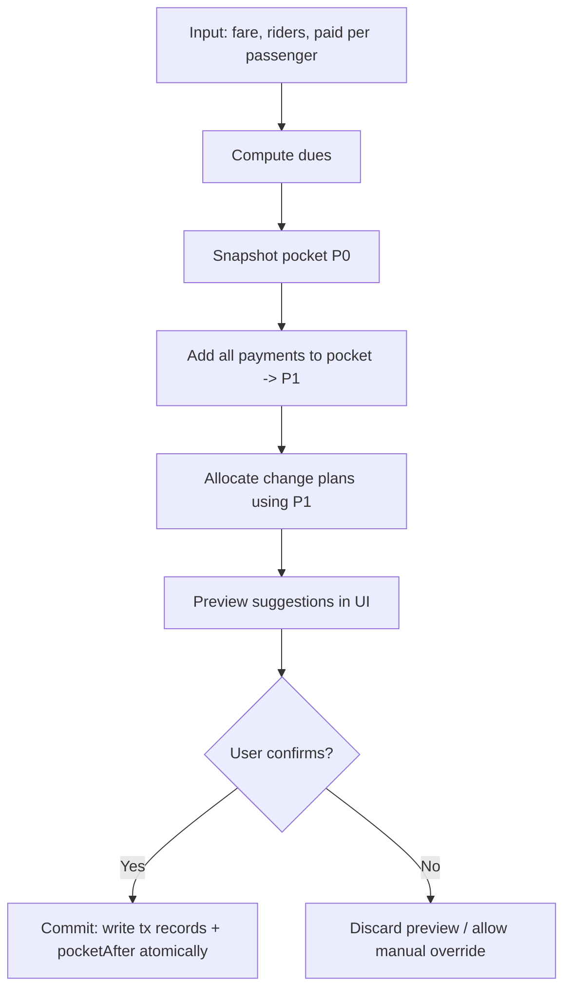

# Implementation-Ready Guideline for a Dart/Flutter Change-Distribution Engine for 2ogra

## Executive summary

Build the 2ogra “change-distribution engine” as a **pure, unit-testable Dart module** that computes *who gets what change* across one or multiple passengers while respecting a **bounded pocket inventory** (limited notes). The engine must support three modes: **fast (greedy)** for immediate UI responsiveness, **smart (bounded DP)** for optimal single allocation under inventory constraints, and **batch (multi-passenger optimizer)** to distribute limited cash across multiple change requests (a knapsack-like allocation problem). Dynamic programming is the standard paradigm for pseudo‑polynomial solutions to change-making variants and knapsack-style resource allocation problems. citeturn2search0turn1search5turn2search13 Riverpod integration should treat the engine as a stateless dependency (`Provider`) and keep mutations (pocket updates, persistence, telemetry) in Notifier-based controllers, leveraging `autoDispose` where screen state is ephemeral. citeturn0search0turn3search3turn2search2turn2search5

## Purpose and required high-level behavior

### Purpose

Implement an engine that, given:

- a fare rule (fare per rider),
- a set of passenger payments (each passenger/group: riders + amount paid),
- and the collector’s pocket inventory (counts per denomination),

returns:

- per-passenger **exact change owed**,
- per-passenger **suggested note breakdown** (e.g., “2×10, 1×5”),
- and the **updated pocket inventory** after receiving payments and giving change,

with explicit handling for infeasible cases and an optional, policy-governed rounding fallback.

### Non-negotiable behaviors

The engine must:

- **Add incoming payments to the available pocket before allocating change** (especially important in batch settlement).
- Produce **feasible allocations only** (never suggest notes not in pocket).
- Prefer allocations that **minimize count of notes** and optionally **preserve small change** (configurable).
- Provide deterministic outputs (same inputs → same plan), enabling stable UI and test expectations.

### Performance target

- **Single allocation:** < 1 second worst-case, including bounded DP, on mid-range Android devices.
- **Batch mode:** bounded by a configurable time/depth limit; if exceeded, fall back to a greedy or sequential strategy.

If batch optimization risks UI jank, offload the heavy work to an isolate using Flutter’s `compute()` or Dart’s `Isolate.run()`; isolates do not share memory and communicate by message passing. citeturn0search1turn1search6turn2search7turn3search0

## Data models and exact inputs/outputs

### File output requirement for the code editor AI

Produce production-ready Dart files:

- `lib/src/engine/models.dart`
- `lib/src/engine/scoring.dart`
- `lib/src/engine/change_engine.dart`
- `lib/src/engine/batch_allocator.dart`
- `lib/src/engine/engine_facade.dart`
- `lib/src/engine/riverpod_providers.dart`
- `test/engine/change_engine_test.dart`
- `test/engine/batch_allocator_test.dart`
- `test/engine/property_invariants_test.dart` (optional but recommended)

### Money representation

Use **integer minor units** (`int`) everywhere (no doubles). Define “minor unit” as the smallest supported denomination unit in your denomination set. (For the MVP if you only support whole EGP, minor unit = 1 EGP, and denom list = `{1,5,10,20,50,100,200}`.)

### Data model summary table

| Model | Purpose | Key fields |
|---|---|---|
| `DenominationSet` | Defines currency system | `List<int> denomsDesc`, `int unit`, `int gcd` |
| `PocketInventory` | Bounded cash availability | `Map<int,int> counts`, helpers |
| `PassengerPayment` | A passenger/group payment input | `String id`, `int riders`, `int paidMinor` |
| `PassengerDue` | Derived owed and change | `String id`, `int dueMinor`, `int changeDueMinor` |
| `ChangeItem` | One denomination line | `int denomMinor`, `int count` |
| `ChangePlan` | One passenger’s planned change | `String passengerId`, `status`, `List<ChangeItem>`, `roundingDeltaMinor` |
| `BatchAllocationResult` | Batch settlement result | `List<ChangePlan>`, `PocketInventory pocketAfter`, `EngineMode modeUsed`, `List<String> warnings` |
| `EngineConfig` | Tunable behavior | weights, flags, limits |
| `EngineDiagnostics` | Non-sensitive telemetry hints | `modeUsed`, `latencyMs`, `feasible`, bucket fields |

### Implementation-ready Dart model definitions

Put the following in `lib/src/engine/models.dart`:

```dart
// lib/src/engine/models.dart
import 'package:meta/meta.dart';

typedef Money = int;       // integer minor units
typedef Denom = int;       // denomination value in minor units

@immutable
class DenominationSet {
  final List<Denom> denomsDesc; // must be sorted descending
  final Money unit;            // smallest supported unit
  final Money gcd;             // gcd of all denoms, used for DP scaling

  const DenominationSet({
    required this.denomsDesc,
    required this.unit,
    required this.gcd,
  });

  factory DenominationSet.egpWhole() {
    // Whole EGP MVP set: 1,5,10,20,50,100,200
    final denoms = <int>[200, 100, 50, 20, 10, 5, 1];
    return DenominationSet(denomsDesc: denoms, unit: 1, gcd: 1);
  }
}

@immutable
class PocketInventory {
  final Map<Denom, int> counts; // denom -> count (>=0)

  const PocketInventory(this.counts);

  int countOf(Denom d) => counts[d] ?? 0;

  PocketInventory addDenom(Denom d, int delta) {
    final next = Map<Denom, int>.from(counts);
    final v = (next[d] ?? 0) + delta;
    if (v < 0) throw StateError('Pocket underflow for denom=$d');
    next[d] = v;
    return PocketInventory(next);
  }

  PocketInventory addPayment(Denom paidDenom) => addDenom(paidDenom, 1);

  PocketInventory applyChange(List<ChangeItem> items) {
    var p = this;
    for (final it in items) {
      p = p.addDenom(it.denomMinor, -it.count);
    }
    return p;
  }

  bool canPay(List<ChangeItem> items) {
    for (final it in items) {
      if (countOf(it.denomMinor) < it.count) return false;
    }
    return true;
  }
}

@immutable
class PassengerPayment {
  final String id;
  final int riders;
  final Money paidMinor; // total paid amount in minor units

  const PassengerPayment({
    required this.id,
    required this.riders,
    required this.paidMinor,
  });
}

@immutable
class PassengerDue {
  final String id;
  final int riders;
  final Money dueMinor;
  final Money paidMinor;
  final Money changeDueMinor; // paid - due (negative => underpayment)

  const PassengerDue({
    required this.id,
    required this.riders,
    required this.dueMinor,
    required this.paidMinor,
    required this.changeDueMinor,
  });
}

@immutable
class ChangeItem {
  final Denom denomMinor;
  final int count;

  const ChangeItem(this.denomMinor, this.count);
}

enum ChangeStatus { exact, rounded, infeasible, underpaid }

@immutable
class ChangePlan {
  final String passengerId;
  final ChangeStatus status;
  final Money dueMinor;
  final Money paidMinor;
  final Money changeDueMinor;
  final List<ChangeItem> items; // empty if infeasible/underpaid
  final Money roundingDeltaMinor; // how much "kept" (0 if none)
  final String? note; // brief UI hint ("request smaller bill", etc.)

  const ChangePlan({
    required this.passengerId,
    required this.status,
    required this.dueMinor,
    required this.paidMinor,
    required this.changeDueMinor,
    required this.items,
    required this.roundingDeltaMinor,
    this.note,
  });
}

enum EngineMode { fastGreedy, smartDp, batchSearch, fallbackGreedy }

@immutable
class BatchAllocationResult {
  final EngineMode modeUsed;
  final List<ChangePlan> plans;
  final PocketInventory pocketAfter;
  final List<String> warnings;
  final int latencyMs;

  const BatchAllocationResult({
    required this.modeUsed,
    required this.plans,
    required this.pocketAfter,
    required this.warnings,
    required this.latencyMs,
  });
}

@immutable
class EngineConfig {
  // Strategy toggles
  final bool preserveSmallChange;
  final bool minimizeNoteCount;

  // Rounding policy
  final bool roundingEnabled;
  final Money roundingMaxMinor;
  final bool roundingOnlyIfInfeasible;

  // Batch search controls
  final int topKPlansPerPassenger;
  final int searchDepthLimit;
  final int timeBudgetMs;

  const EngineConfig({
    required this.preserveSmallChange,
    required this.minimizeNoteCount,
    required this.roundingEnabled,
    required this.roundingMaxMinor,
    required this.roundingOnlyIfInfeasible,
    required this.topKPlansPerPassenger,
    required this.searchDepthLimit,
    required this.timeBudgetMs,
  });

  factory EngineConfig.mppDefaults() => const EngineConfig(
        preserveSmallChange: true,
        minimizeNoteCount: true,
        roundingEnabled: false,
        roundingMaxMinor: 0,
        roundingOnlyIfInfeasible: true,
        topKPlansPerPassenger: 8,
        searchDepthLimit: 10,
        timeBudgetMs: 300, // keep batch fast; escalate to isolate if higher
      );
}
```

## Algorithms, scoring function, and pocket semantics

### Why this is a constrained optimization problem

- Single passenger exact change under inventory constraints is a **bounded change-making/knapsack-style** decision, solvable with pseudo‑polynomial DP in the target amount. citeturn1search5turn1search4turn2search6  
- Multi‑passenger distribution becomes a **resource allocation** problem (combinatorial), and exhaustive optimal search is not scalable without bounds; use heuristics + pruning. Knapsack-class problems are widely studied as NP-hard in the general case. citeturn1search5turn2search13

### Pocket inventory semantics

Implement these semantics exactly:

1. **Snapshot** the current pocket `P0`.
2. **Add all incoming payments** to create `P1` (this matters for batch settlement).
3. Allocate change using **P1** producing a plan set `Plans`.
4. Compute `P2 = P1 - sum(Plans.items)`.
5. Only after user confirmation, **commit** `P2` and persisted transaction records atomically.

Never mutate pocket during “preview” computations; treat plans as proposals until commit.

### Mode trade-offs table

| Mode | When to use | Guarantees | Risk | Complexity (typical) |
|---|---|---|---|---|
| Fast / Greedy | UI instant feedback | Very fast; may fail even if solution exists under bounds | Can produce infeasible/poor plan; must fall back | O(D) |
| Smart / Bounded DP | Single passenger “best” plan | Finds best-scored plan for a target under inventory bounds (within DP design) | DP array size depends on target scale | O(D * T * C) or optimized |
| Batch / Search | Multiple passengers | Attempts globally better allocation; bounded by time/depth | Worst-case exponential; must prune & fallback | O(K^N) with pruning |

Dynamic programming and knapsack-style approaches are standard for such optimization paradigms. citeturn2search0turn1search5turn1search4

### Scoring function (tunable weights)

Put scoring in `lib/src/engine/scoring.dart`. The score is minimized.

**Rationale:** fewer notes is faster; preserving 1/5 EGP prevents future infeasible situations; depleting critical denoms should be penalized if PreserveSmallChange is enabled.

Define:

- `noteCountPenalty`: strong base weight per note
- `smallDenomPenalty`: extra weight for using 1 and 5 (and optionally 10)
- `depletionPenalty`: penalty for consuming the last remaining note of a denom (helps future feasibility)

Implementation-ready scoring:

```dart
// lib/src/engine/scoring.dart
import 'models.dart';

class ScoreWeights {
  final int perNote;
  final Map<Denom, int> perDenomUse;       // penalty per note of denom used
  final Map<Denom, int> perDenomDeplete;   // penalty if denom becomes 0 after use

  const ScoreWeights({
    required this.perNote,
    required this.perDenomUse,
    required this.perDenomDeplete,
  });

  factory ScoreWeights.defaultsEgp() => const ScoreWeights(
        perNote: 10,
        perDenomUse: {
          1: 20,
          5: 8,
          10: 3,
        },
        perDenomDeplete: {
          1: 15,
          5: 8,
          10: 4,
          20: 2,
        },
      );
}

int scorePlan({
  required List<ChangeItem> items,
  required PocketInventory pocketBeforePayout,
  required ScoreWeights w,
}) {
  var score = 0;
  var totalNotes = 0;

  // Count notes + denom-use penalties
  for (final it in items) {
    totalNotes += it.count;
    final usePenalty = (w.perDenomUse[it.denomMinor] ?? 0) * it.count;
    score += usePenalty;
  }
  score += totalNotes * w.perNote;

  // Depletion penalty (simulate payout)
  for (final it in items) {
    final before = pocketBeforePayout.countOf(it.denomMinor);
    final after = before - it.count;
    if (after == 0) {
      score += (w.perDenomDeplete[it.denomMinor] ?? 0);
    }
  }
  return score;
}
```

Tune weights via `EngineConfig` toggles:

- If `minimizeNoteCount == true`, increase `perNote`.
- If `preserveSmallChange == true`, keep high penalties for 1/5.

### Mode algorithms with pseudocode and complexity notes

#### Fast mode (greedy + bounded fallback)

Use greedy only as a first pass because greedy can fail under bounded inventory.

**Pseudocode:**
```
function greedyBounded(target, pocket, denomsDesc):
  plan = {}
  rem = target
  for d in denomsDesc:
    take = min(pocket[d], rem // d)
    plan[d] = take
    rem -= take * d
  if rem == 0: return plan else return null
```

If null → run smart DP.

Complexity: O(D) where D is number of denominations.

#### Smart mode (bounded DP returning best-scored plan)

Implement a bounded DP that returns the **best scored plan** for exact change.

A safe approach: DP over amounts, keeping the best plan (by score) for each reachable amount. DP is a standard method for problems with overlapping subproblems and optimal substructure. citeturn1search4turn2search0

**Pseudocode (bounded DP, constrained by counts):**
```
dp[0] = emptyPlan
for denom d in denomsDesc:
  repeat count times:
    for amt from target downTo d:
      if dp[amt - d] exists:
        candidate = dp[amt-d] + d
        dp[amt] = minByScore(dp[amt], candidate)
return dp[target]
```

Complexity: O(T * sum(counts)) worst case. In practice, with EGP whole units, T is small (~0..200), so this is fast.

If you support sub-denominations (e.g., 0.5 EGP), reduce DP size by scaling amounts by `gcd(denoms)` before DP.

#### Batch mode (multi-passenger optimizer with backtracking + pruning)

Batch distribution is combinatorial (knapsack-like). Use bounded search:

1. Compute all passenger change dues.
2. Add all payments to pocket.
3. For each passenger, generate top‑K candidate plans via bounded DP with scoring.
4. Backtrack through passengers in an order that prunes early:
   - sort by descending change due,
   - or by fewest candidate plans first.
5. Stop when time budget exceeded; return best found or fallback sequential.

**Pseudocode (top‑K + backtracking):**
```
candidates[i] = topKPlans(changeDue[i], pocket, K)
order passengers by (fewest candidates, then higher changeDue)

best = null
dfs(i, pocket, accumScore, chosenPlans):
  if timeExceeded or i == len:
    update best if better
    return
  pid = order[i]
  for plan in candidates[pid]:
    if pocket canPay(plan):
      dfs(i+1, pocket - plan, accumScore + score(plan), chosenPlans+plan)
```

Complexity: bounded by K^N, but with small N (practically 1–6) and tight time limits, it is workable. Use pruning heuristics: if `accumScore >= bestScore`, stop.

If batch is heavy (e.g., large N), move this to an isolate. Flutter’s `compute()` runs expensive functions on a background isolate to avoid jank; Dart’s `Isolate.run()` provides a simplified isolate API and returns results/errors back to the main isolate. citeturn0search1turn2search7turn2search1turn3search0

## Engine API surface, Riverpod integration, and persistence hooks

### Required engine facade API

Put this in `lib/src/engine/engine_facade.dart`:

```dart
import 'models.dart';
import 'scoring.dart';

class ChangeDistributionEngine {
  final DenominationSet denomSet;
  final ScoreWeights weights;

  const ChangeDistributionEngine({
    required this.denomSet,
    required this.weights,
  });

  /// Computes dues for UI display & for allocation.
  List<PassengerDue> computeDues({
    required Money farePerRiderMinor,
    required List<PassengerPayment> payments,
  }) {
    return payments.map((p) {
      final due = farePerRiderMinor * p.riders;
      final change = p.paidMinor - due;
      return PassengerDue(
        id: p.id,
        riders: p.riders,
        dueMinor: due,
        paidMinor: p.paidMinor,
        changeDueMinor: change,
      );
    }).toList(growable: false);
  }

  /// Allocates change for a batch; may choose mode based on config and batch size.
  Future<BatchAllocationResult> allocateBatch({
    required Money farePerRiderMinor,
    required List<PassengerPayment> payments,
    required PocketInventory pocketBefore,
    required EngineConfig config,
    required DateTime startedAt,
  }) async {
    // Implementation in change_engine.dart + batch_allocator.dart
    throw UnimplementedError();
  }
}
```

### Provider API list table (Riverpod)

Riverpod guidance: wrap app in `ProviderScope`; use `autoDispose` for ephemeral providers; override providers for tests/environments. citeturn2search5turn3search3turn2search2

| Provider | Type | Purpose |
|---|---|---|
| `denominationSetProvider` | `Provider<DenominationSet>` | Global currency config |
| `engineConfigProvider` | `Provider<EngineConfig>` or `NotifierProvider` | Strategy toggles from settings |
| `engineProvider` | `Provider<ChangeDistributionEngine>` | Stateless engine dependency |
| `pocketControllerProvider` | `NotifierProvider<PocketCtrl, PocketInventory>` | Read/update pocket |
| `collectControllerProvider` | `AutoDisposeNotifierProvider<CollectCtrl, CollectState>` | Screen-level orchestration: compute → preview → commit |

Use Notifier-based providers because they are intended for state that changes in reaction to user interactions. citeturn0search0turn3search3

### Riverpod wiring file

Create `lib/src/engine/riverpod_providers.dart`:

```dart
import 'package:flutter_riverpod/flutter_riverpod.dart';
import 'models.dart';
import 'scoring.dart';
import 'engine_facade.dart';

final denominationSetProvider = Provider<DenominationSet>((ref) {
  return DenominationSet.egpWhole();
});

final scoreWeightsProvider = Provider<ScoreWeights>((ref) {
  return ScoreWeights.defaultsEgp();
});

final engineProvider = Provider<ChangeDistributionEngine>((ref) {
  final denom = ref.watch(denominationSetProvider);
  final weights = ref.watch(scoreWeightsProvider);
  return ChangeDistributionEngine(denomSet: denom, weights: weights);
});
```

### Transaction flow and commit semantics

Implement flow in your “collect controller” (Notifier):



For persistence:

- SQLite: wrap updates in a DB transaction (atomicity).
- Hive: emulate atomic commit by writing a single “commit record” that includes pocketAfter + transactions, or write pocketAfter last and use a `pendingCommitId` to recover.

## Edge cases, concurrency guidance, telemetry hooks, and testing

### Edge case handling requirements

Implement explicit outcomes:

- **Underpayment** (`changeDue < 0`): `ChangeStatus.underpaid`, no payout items, pocket still receives paid amount.
- **Exact change**: `ChangeStatus.exact`, items may be empty.
- **Infeasible change**: `ChangeStatus.infeasible`, provide actionable `note` (“request smaller bill”, “IOU/partial”).
- **Rounding policy (optional)**:
  - Only if `roundingEnabled == true`.
  - If `roundingOnlyIfInfeasible == true`, attempt rounding only after exact infeasible.
  - Rounding means: give `changeDue - delta`, record `roundingDeltaMinor = delta`, and set status `rounded`.
- **Manual override**: controller may accept a user-selected payout; validate `pocket.canPay(items)` then commit.

### Concurrency/isolate guidance

If batch search is heavy:

- Use Flutter `compute()` to run a synchronous pure function in a background isolate (avoids UI jank). citeturn0search1turn3search0  
- For non-Flutter contexts or more control, use `Isolate.run()`; it spawns an isolate, runs a function, returns result, and propagates errors. citeturn2search7turn2search1  
- Ensure arguments/results are isolate-sendable; isolates don’t share memory and communicate by messaging. citeturn1search6turn2search7

### Telemetry hooks (non-sensitive, bucketed)

Emit events from the controller (not from pure engine code). Use a wrapper that’s a no-op if analytics is disabled.

Required events (bucketed, no raw amounts):

- `txn_calculated`: `{modeUsed, ridersCount, paidDenomBucket, feasible, latencyBucket, pocketModeUsed}`
- `infeasible_change`: `{changeDueBucket, constraintType}`
- `rounding_applied`: `{deltaBucket, policyMode}`
- `allocation_decision`: `{modeUsed, passengersCountBucket, searchDepthUsedBucket, candidatesAvgBucket}`

### Testing plan and scenarios

Use `package:test` for unit tests; it’s the standard Dart testing library, and Dart’s official docs recommend it for unit tests. citeturn3search2turn3search6turn3search9

Also include **property-based tests** (optional but valuable for catching corner cases) using a PBT library such as `property_testing` or `dartproptest`. citeturn0search3turn0search7

#### Required unit tests (deterministic)

Write unit tests for:

- `computeDues()` correctness.
- Greedy bounded returns null when infeasible.
- DP returns feasible exact plan when exists.
- Score function ranks “20” better than “10+10” (when preserveSmallChange on, weights consistent).
- `PocketInventory.applyChange()` underflow throws and `canPay()` blocks invalid allocations.
- Batch allocator succeeds on simple cases.

#### “Expected output” example scenarios

Scenario A (two passengers, sufficient change):

- Denoms: [200,100,50,20,10,5,1]
- Fare = 15
- Pocket: {20:1,10:4,5:2,1:0}
- Payments:
  - A: riders=2, paid=50 → change=20
  - B: riders=1, paid=20 → change=5
Expect:
- A plan: 20×1 (or 10×2 if configured to preserve 20)
- B plan: 5×1
- pocketAfter updated accordingly

Scenario B (infeasible exact):

- Pocket: {10:1,5:0,1:0}
- Passenger needs change 5
Expect infeasible with note “request smaller bill” unless rounding enabled.

#### Property invariants (for PBT)

For any generated input where engine returns feasible:

- `sum(items) == changeDue - roundingDelta`
- for each denom: `usedCount <= pocketAvailableAfterPayments`
- pocketAfter counts never negative
- deterministic: repeated runs return same result (given same snapshot and config)

### Performance instrumentation

- Record latency with `Stopwatch` around allocation.
- Ensure UI frame budget stays healthy (Flutter targets ~16ms/frame at 60fps to avoid jank). citeturn3search0  
- If batch mode exceeds time budget in debug/profiling, route it to an isolate and show a “Computing…” micro-indicator.

---

## Final instruction to the AI code editor

Implement the specified Dart files with:

1. The exact models and semantics above.
2. Greedy + bounded DP + batch optimizer with tunable scoring.
3. Riverpod providers for dependency injection and test overrides. citeturn2search2turn2search5turn0search0turn3search3
4. Unit tests and (optional) property tests using `package:test` and a PBT library. citeturn3search2turn0search3turn0search7
5. A controller integration point that:
   - snapshots pocket,
   - computes preview allocation,
   - emits bucketed analytics events,
   - commits pocket + transaction records atomically to Hive/SQLite.

Use isolates (`compute()` / `Isolate.run()`) only for batch workloads that risk UI jank, keeping the engine’s core functions pure and isolate-safe. citeturn0search1turn2search7turn1search6turn3search0